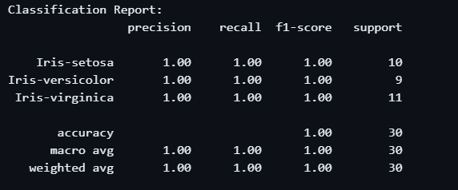
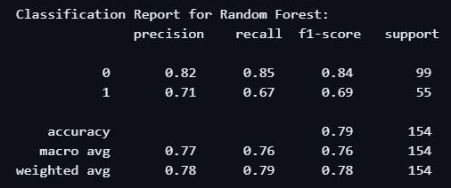
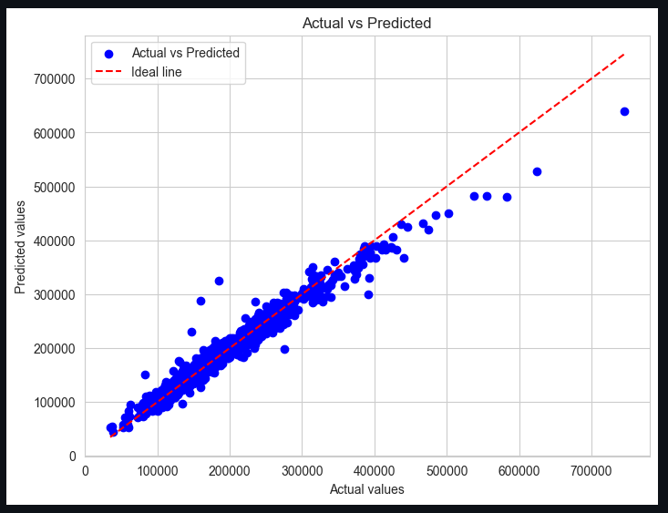

# First ML Project 2024 Sem_3

### Task 1: Classify Iris Flowers

Used the Iris dataset from UCI Machine Learning Repository with the Random Forest Classifier model.

 > Summary
  > 1) Data Loading: Loaded the Iris dataset.
  > 2) Data Visualization: Visualized data using pair plots and a correlation heatmap.
  > 3) Data Preprocessing: Split the data into training and testing sets and scaled the features.
  > 4) Model Training: Trained a Random Forest Classifier.
  > 5) Model Evaluation: Evaluated the model using a confusion matrix and classification report.
  > 6) Results Visualization: Visualized the confusion matrix.

### Task 2: Diabetes Prediction

Used Logistic Regression on the Pima Indians Diabetes Database, achieving 78.5% accuracy.

### Task 3: Predicting House Prices

For this project, I used the House Prices - Advanced Regression Techniques dataset available on Kaggle to predict house prices and used Linear Regression to achieve mean absolute error of 16501 as of now and the lowest was 15339.
